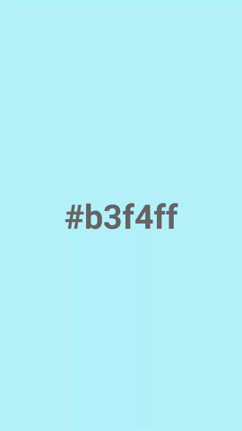

# QUOZ
Android app for generating random pastel colours. Also it's pronounced like "kwots".

## Install
Find the APK [here](app/release/app-release.apk) and click on the download button. You'll have to enable installing from [unknown sources](https://developer.android.com/distribute/tools/open-distribution.html#unknown-sources) to install it. Just tap on the file when it's done downloading. Works for Android 5.0+ (Lollipop, Marshmallow, Nougat, Oreo). [Direct download link for the fearless.](https://github.com/nonphatic/QUOZ/raw/master/app/release/app-release.apk)

## Features and Settings
When you open the app, tap to change colour and long-press to copy the colour hex code. Swipe down to show the settings button and swipe up to hide it. 
### Saturation
Slide left for lower saturation (pasteller) and right for higher saturation (neoner). The very left is pure white, so tapping on the colour won't do anything. The best pastel colours are somewhere to the left of centre.
### Change mode
* **Tap** (default): you have to tap the screen to change colours.
* **Cycle**: colours will change every one second.
* **Leekspin**: colours will change to the approximate beat of "Ievan Polkka".
* **Nyan**: colours will change to the approximate beat of "Nyanyanyanyanyanyanya!".

Maybe lower your phone volume when in public.
### Reset settings
Tap to undo your life mistakes. Currently buggy.

## Demo

